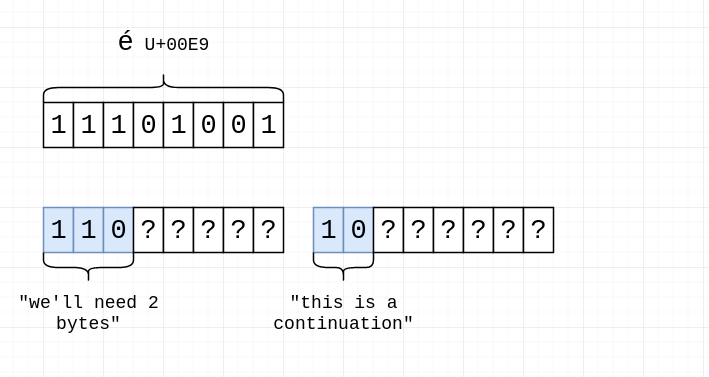
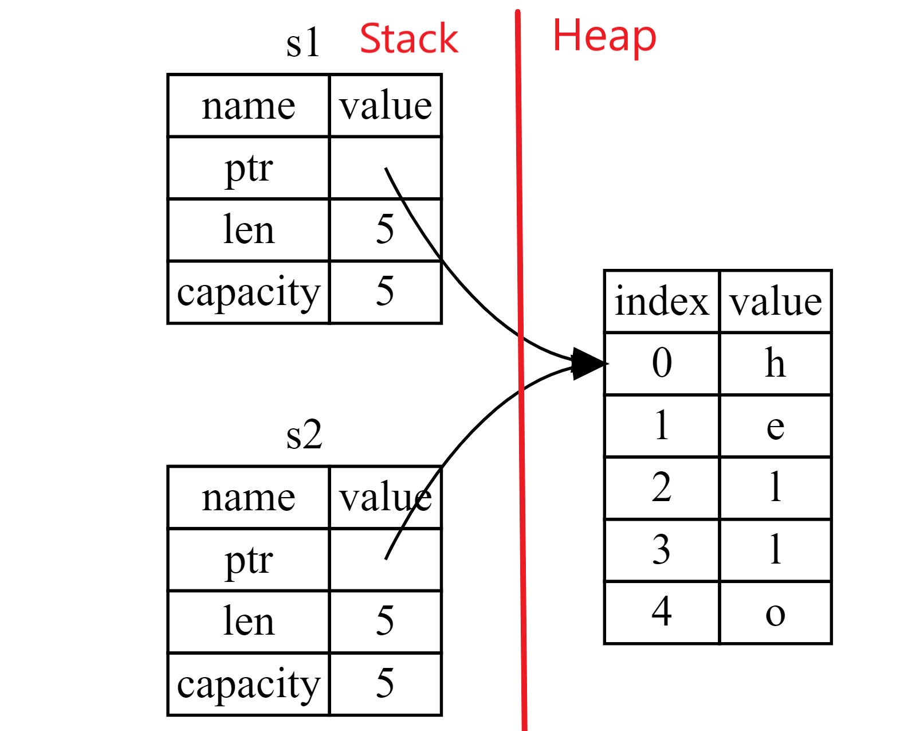
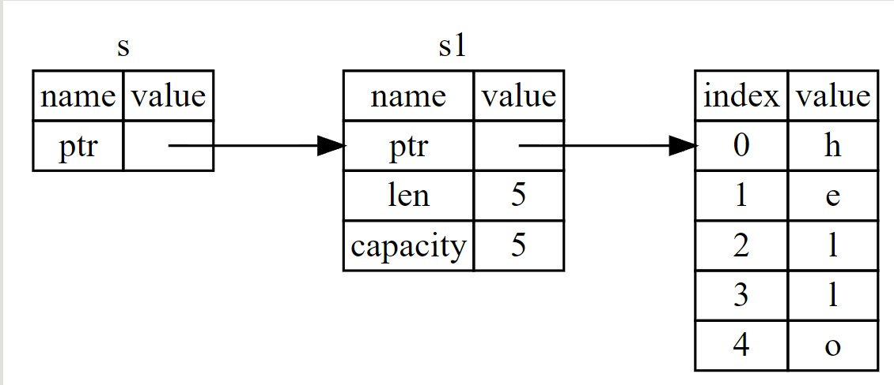
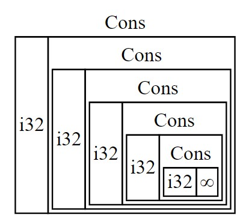
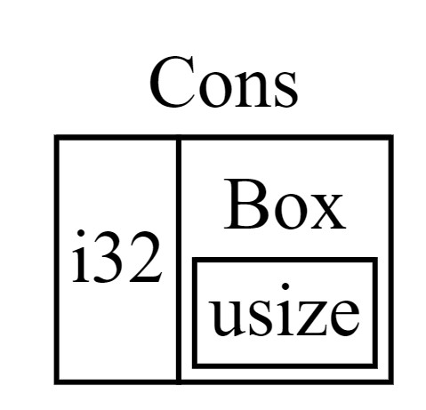
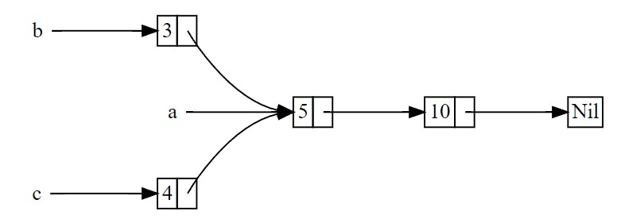

# Rust Programming Language
Author Name
:doctype: article
:encoding: utf-8
:lang: en
:toc: left
:numbered:
:imagesdir: images
:source-language: Rust


## Overview
### Characteristics
* Precompiled just like C.
* zero-cost abstractions: higher-level features that compile to lower-level code as fast as code written manually.
* Includes the official building system & packet manager *Cargo*, allowing the user to control and build dependencies. 
* *Snake case* as the conventional style for function and variable names. In snake case, all letters are lowercase and underscores separate words. E.g. variable_name;

### Developer tools in Rust
* **Cargo**: the included dependency manager and build tool(similar to Makefile but native), makes adding, compiling, and managing dependencies painless and consistent across the Rust ecosystem.
Cargo has a mechanism that ensures you can rebuild the same artifact every build (Cargo.TOML). Cargo will use only the versions of the dependencies you specified until you indicate otherwise. To ignore manual versions or to upgrade a package use [underline]#cargo update# (-update_only_optional_Packet) which will update dependencies to latest versions.
* **Rustfmt**: ensures a consistent coding style across developers.
* The Rust **Language Server**: powers Integrated Development Environment (IDE) integration for code completion and inline error messages.
* **Crate**: collection of Rust source code files (Basically a library).
* The *Prelude* is the most basic library that possesses the minimum functionalities that Rust need to import into every program, it includes traits of fundamental types, destructors and overloading, heap allocation, ownership, clone, comparison traits, generic conversions, iterators, heap allocated strings and vectors.

### Fields on Rust
Command line tools, web services, DevOps tooling, embedded devices, audio and video analysis and transcoding, cryptocurrencies, bioinformatics, search engines, Internet of Things applications, machine learning, and even major parts of the Firefox web browser.

### Compiling

.Compiling your project
[width="100%",options="header,footer"]
|====================
| Instruction | Description 
| Cargo new {name}  +
    --lib | Generates the packet manager folder for Cargo to manage your rust project +
    -- Creates a library(lib.rs) 
| Cargo build +
--release + 
--target {TRIPLET} | Compiles Rust program and creates an executable file in target/debug folder + 

-- Compiles with optimizations (superfast code however is slower compilation time) + 

-- Cross-compiles for a target denoted by the TRIPLET. E.g. thumbv7m-none-eabi 
| ./target/debug/{Cargo_File} | Runs the program stored on the Default path of the project, once Cargo builds the project. 
| Cargo run | Builds and runs the program in one step. 
| Cargo check | Check correct compiling without producing an executable (speed-up the process) 
| Use | Import library 
| cargo readobj --bin {project} + 

-- -file-headers | can print the ELF headers to confirm that this is an ARM binary 
| Cargo-size --bin {project} --release -- -A | can print the size of the linker sections of the binary.
 
| cargo fmt | Reformats your code according community code style 
|====================


## Rust Fundamentals
### Variables
let -> Creates a variable.

{}  -> Curly brackets are the “format specifiers” (similar to % in C) of Rust. In Rust they are just a place holder. 
E.g. Print to console

```
a) println! ("x = {} and y = {}", x, y); 		// Prints the output to the screen.
b) let s = format! ("x = {} and y = {}", x, y);  	// Returns a String with the contents (but doesn’t print anything)
```

There exist a lot of format specifiers for rust, for example:

```
println!("{} (U+{:04X}) ", c, c as u32);
$ cargo run --quiet -- "aimée" 	// a (U+0061) i (U+0069) m (U+006D) é (U+00E9) e (U+0065)
```
{:02X} – for individual bytes (change 2->4 for hexadecimals)

### Data Types
Rust is a statically typed language, which means that it must know the types of all variables at compile time.  The compiler can usually infer what type we want to use based on the value and how we use it. In cases when many types are possible, such as when converting a String to a numeric type using parse, we must add a type annotation. 

#### Boolean type
In Rust, Booleans are [red]#one byte# in size. Boolean type is specified by bool keyword: `let f: bool = false;`

```
E.g. let number = 3;
if number { println!("number was three"); }	//Error: expected bool, found integer
```
Rust will [red]#not automatically# try to convert non-Boolean types to a Boolean, it must be explicit and provide a Boolean value for safety. Note that "if" does not require parenthesis. 

#### Rust’s char type
Char is [red]#always 4 bytes# in size that uses [blue]#codepoint<-->UTF-8# (encoding method that uses 1-4 one-byte code units(Basically UTF-8 up to 4 bytes)) to represent Unicode characters(Unicode is a standard, which defines a map from characters to numbers, the so-called code points). Which means it can represent a lot more than just ASCII, like emojis with his 1,112,064 valid characters. However, [underline]##in a char not always the 4 bytes have information##. In UTF-8 encoding, the higher part indicates the #ofBytes needed to store the symbol ranging from 1 to 4 bytes:  

* If a byte starts with 0 it means [blue]#only one byte#(128 different combinations) has information. For retrocompatibility, this characters represent the same 128 first characters as ASCII.
* If a byte starts with 110 it means we’ll use two bytes
* If a byte starts with 1110 it means we'll use three bytes
* If a byte starts with 11110 it means we'll use four bytes
* If a byte starts with 10, it means it's a continuation of a multi-byte character sequence.


.Code point <-> UTF-8 conversion
[width="100%",options="header,footer"]
|====================
|First code point  |Last code point |Byte 1  |Byte 2|Byte 3|Byte 4
|U+0000 |U+007F |0xxxxxxx ||| 
|U+0080 |U+07FF |110xxxxx |10xxxxxx ||
|U+0800 |U+FFFF |1110xxxx |10xxxxxx  |10xxxxxx |
|U+10000 |U+10FFFF |11110xxx |10xxxxxx|10xxxxxx|10xxxxxx |10xxxxxx 
|====================
The following example encodes “é” by using 2 bytes(right align), leftover bits are filled with 0 (called padding).  

.Encoding “é” in UTF-8 (? Represents a free bit for data)



#### Integer type
An integer is a number without a fractional component. It can be type annotated as follows:
```
let number = 13;		//implicit data type
let number: i32 = 13;	//explicit data type
```


.Integer types
[width="50%",options="header,footer"]
|====================
|Length	| Signed| Unsigned
| 8-bit | i8 |  u8
| 16-bit | i16 |  u16
| 32-bit | i32 |  u32
| 64-bit | i64 |  u64
| 128-bit | i128 |  u128
| Arch (Architecture dependent)| isize |  usize
3+| Rust defaults integers to i32  
|
|====================

.Number literals
[width="50%",options="header,footer"]
|====================
| Number literals | Example     
| Decimal         | 98_222      
| Hex             | 0xff        
| Octal           | 0o77        
| Binary          | 0b1111_0000 
| Byte (u8 only)  | b'A'        
|====================
Signed numbers are stored using two’s complement representation. Furthermore, you can use “_” as a visual separator

[NOTE]
====
Final note: Integer overflow

- In debug mode, Rust includes checks for integer overflow that cause your program to panic at runtime if an overflow occurs.
- In release mode, rust doesn’t include checks. So, if overflow occurs, Rust performs two’s complement wrapping(256 becomes 0 in a u8). Relying on integer overflow is an error, you should explicitly handle these types of situation with wrapping_* methods(this is a reason why c produces unknown behaviors).
====

#### Float type
f32(single precision) and f64(**default**, double precision) are used for numbers with decimal points. Floating-point numbers are represented according IEEE-754 standard.

#### Arrays vs Vectors
*Arrays* 

Arrays are useful when you want your data allocated on the [green]#**stack**# rather than the heap or when you want to ensure you always have a [underline]#fixed# number of elements. E.g. 

```
let a: [i32; 5] = [1, 2, 3, 4, 5];		 //array with type i32 with 5 elements.
let a = [3;5]			//array with 5 elements initialize with same value 3(due to “;”).
```

An array isn’t as flexible as the vector type though. A *vector* is a similar collection type provided by the standard library, it can grow or shrink in size(stored on [green]#**heap**#).

*Tuple* 

A tuple is a general way of [underline]#grouping together# several values with a variety of types into one compound type. Tuples have a fixed length: once declared, [red]#they cannot grow or shrink in size#.

Tuples can be destructured(splitted) using patter matching and can be accessed using period “.”. E.g:
```
let tup: (i32, f64, u8) = (500, 6.4, 1);
let five_hundred = tup.0;
let six_point_four = tup.1;
let one = tup.2;
```

*Shadowing:*

Shadowing let us reuse variables with same name, rather than forcing us to create two unique variables. The second variable’s value is what appears when the variable is used. It’s also possible to change the type of the variable since we’re effectively creating a new variable. E.g. 

```
let word = “Hello”; 	//word is type string slice (&str)
let word = word.len();   	//word is type usize with value 5
```
### Strings
The [blue]#**String**# type is the most common type that has ownership over his contents, it’s growable and [blue]#UTF-8 encoded#, so it has a variable length that range from 1 and up to 6 bytes(the 8 in UTF-8 refers to the size of the code unit, which is 8 bits. For UTF-16 its 16 bits and so on). Rust ensure this and panics if you try to put invalid UTF-8 symbols). 

.UTF-8 (1993)[2]. (x represents data)*
[width="100%",options="header,footer"]
|====================
|#of Bytes |First code point  |Last code point |Byte 1  |Byte 2|Byte 3|Byte 4 | Byte 5 | Byte 6
|1|U+0000    |U+007F     |0xxxxxxx |||||
|2|U+0080    |U+07FF     |110xxxxx |10xxxxxx ||||
|3|U+0800    |U+FFFF     |1110xxxx |10xxxxxx|10xxxxxx |||
|4|U+10000   |U+10FFFF   |11110xxx |10xxxxxx|10xxxxxx|10xxxxxx ||
|5|U+200000  |U+3FFFFFF  |111110xx |10xxxxxx|10xxxxxx|10xxxxxx |10xxxxxx|
|6|U+4000000 |U+7FFFFFFF |1111110x |10xxxxxx|10xxxxxx|10xxxxxx |10xxxxxx|10xxxxxx
|
|====================

Memory is requested from the memory allocator at [red]#runtime# and returned(drop) via ownership system. To create a String(mutable) from a [underline]##**string literal**##(immutable, known and hardcoded into de executable at compile time (string literals are inside “” symbol)): 

```
let mut s = String::from("hello"); 	//creates a String from a string literal “hello”
s.push_str(", world!"); 		// push_str() appends a literal to a String
println!("{}", s);			 // This will print `hello, world!`
```
Strings are implemented as a Collection of bytes, plus some methods that provide functionality to those bytes when interpreted as text. Rust has ONLY ONE string type in the core language which is [red]#STRING SLICE# (str); the String type is provided as part of Rusts Standard Library rather than the core. However, both, String and str are UTF-8 encoded.

[red]#Indexing isn’t allowed# on Strings because UTF-8 symbols may take more than 1 byte so, invalid character may show up if we tried to return only 1 byte as the following example:
```
let s1 = String::from("♥");
let h = s1[0];	 // Rust doesn’t compile indexing on Strings
//However, if you really want to use indexing, you can use string slices using the range of the slice. Note that this indexing MUST occur at UTF-8 valid characters boundaries so you cannot just read 1 byte of the multibyte heart emoji(3 bytes).
let len = s1.len();
let indexing = &s1[0..len];
```

*Iterating Over Strings*  

Since indexing Strings is out of the table, the recommendation is to access elements as char or bytes. 
 
.Interpreting Strings
[width="100%",options="header,footer"]
|====================
| As chars |  As bytes
|for c in "न म स्ते".chars() {print!("{}", c);	//  न म स स्ते
|for b in "न म स्ते".bytes() {println!("{},", b);         // 224,164..135 
|====================

Strings are hard because: propensity for exposing errors in compile time, complicated structure, and UTF-8. But this will prevent you from having to handle errors involving non-ASCII characters.

#### Slice Type(commonly used as &str)
At the most basic, a slice is a pointer to a block of memory. Slices let you reference a contiguous sequence of elements in a collection rather than the whole collection(for example a part of an array or vector). 

A String slice(&str) can be a reference pointing to an specific point of the binary(string literal) or a reference to part of a String(heap). So, [blue]#String slices# allows indexing on [green]#Strings or string literals#, however, they must occur at valid UTF-8 character boundaries. Slice method [blue]#from# in String tracks a starting and an ending index. E.g.
```
let s = String::from("hello world");
let hello = &s[0..5];
let world = &s[6..11];
```
Slice Program: write a function that takes a string and returns the first word it finds in that string
```
fn first_word(s: &String) -> &str {
let bytes = s.as_bytes();		// Convert our String to an array of bytes
/* iter is a method that returns each element in a collection and that enumerate wraps the result of iter and returns each element as part of a tuple instead */
    for (i, &item) in bytes.iter().enumerate() {
        if item == b' ' {  		//search for byte that represents the “space” (this uses byte literal).
            return &s[0..i]; }  }
    &s[..] }
```

*The advantage of using slices* 

* Validity is ensured by lifetimes: since its referencing memory, the memory must be valid so its safer than Strings. 
* Borrowing rules apply: so no data races occur.
* More generic data type: it can reference string literals or Strings so its widely used in APIs.

#### Two types of strings: String vs %str (and the implications of not having this on C language)
https://fasterthanli.me/blog/2020/working-with-strings-in-rust/

Basically, this article says that in Rust, [green]#String# type values are always UTF-8 valid symbols because you get an error otherwise. It is heap-allocated.
&str refer to data from anywhere: heap, stack or even program’s data segment.

*The implications of not having String on C* 

By comparison, [red]#C has no string type. It doesn't even have a real character type#. C char is.. an ASCII character plus an additional bit - effectively, [red]#it's just a signed 8-bit integer: int8_t#.

* There is absolutely [red]#no guarantee that anything in a char* is a valid UTF-8#, or a valid something for that matter. There is no encoding associated to a char*, which is just an address in memory. There is [red]#no length# associated to it either, so computing its length involves finding the null terminator.
* Null-terminated strings are also a serious security concern. Not to mention that NULL is a valid Unicode character, so null-terminated strings cannot represent all valid UTF-8 strings.

### Operators
--mut:  Assigns mutable (modifiable, non-static content) attribute. In Rust variables are immutable by default to enforce safety and easy concurrency. E.g.:
```
let mut guess = 5;
match number1.cmp(&number2) {         
    Ordering::Less => println!("Number 1 is smaller"),
    Ordering::Greater => println!("Number 1 is larger!"), 	
	_ => (), 			//The “_” pattern will match any value.	
```
**--match**: allows us to compare a value against a series of patterns and then execute code based on which pattern matches. E.g. comparing returns an Ordering enum with 3 possible values: Less, Greater, Equal. Note that match is exhausting so all cases must be handled ( in case you want to handle remaining cases “_” place holder is a useful to match any pattern) 

**--const**: constants are ALWAYS immutable. Furthermore, constants require annotated type and can only be set to a constant expression computed in compile time. `const MAX_POINTS: u32 = 100_000;		//100,000`
In Rust, constants use all upercase with underscores. Also, underscores can be inserted in numeric literals to improve readability.


### Functions & Methods 
#### Functions 

Rust doesn’t care where you define your functions, only that they’re defined somewhere (unlike C, where you must define a function before use it).
In function signatures, you must declare the type of each parameter, this means in the annotated form. E.g. 
```
fn example_function(x: i32, y: i32) { 
    println!(“value of x is: {}”, x) …}
```
*Functions with returning values:* 

Return type goes after an arrow (->). Functions can return early by using the return keyword and specifying a value, but most functions return the last expression implicitly, by not adding semicolon (this means that this is the return value expression).
```
fn plus_one(x: i32) -> i32 { x + 1  }		//no semicolon, so it returns x + 1
plus_one(5); 	//6
```
#### Methods
Methods are similar to functions, they can have parameters, return value  

`object::method()` -> "method" is an associated function of an object type (static method). “::” is like namespace where 2 methods equally named are totally different if they namespace is different. E.g:
```
let guess = String::new();		//method that creates a new instance of a String
instance::method.submethod() -> Calls sub-method on method handle. E.g.: io::stdin().read_line();
```
### Failures
[blue]#Result# types are enumerations. For Result, the variants are Ok or Err. The Ok variant indicates the operation was successful, and inside Ok is the successfully generated value. The Err variant means the operation failed and Err contains information about how or why the operation failed. The purpose of these Result types is to encode error-handling information.

`E.g.: func().expect(“failed”)` -> [blue]#expect# Unwraps a result, yielding the content of an Ok. Otherwise panics and includes message and content of Err.

### Scope {}
A scope is the range within a program for which an item is valid.

### Loops


.Loops
[width="100%",options="header,footer"]
|====================
| For | While | Loop 
| Increased  safety of the code and eliminated the chance of bugs that might result from going beyond the end of the array or not going far enough and missing some items. 
| Useful to evaluate a condition within a loop. However, is slower because the compiler adds runtime code to perform the conditional check on every element on every iteration through the loop. 
| Executes a block of code over and over again forever or until you explicitly tell it to stop. 
|let a = [10, 20, 30, 40, 50];

for element in a.iter() { 

println!("the value is: {}", element);}
|let mut number = 3; 

while number != 0 { 

println!("{}!", number); number -= 1; }
|loop {println!("again!";}
|====================

Note: Loops can return a value with the break statement
```
Let result = loop {
    counter += 1;
    if counter == 10 {
        break counter * 2;
    }
};				// the ; makes the loop a statement, assigning the counter value to result.
```

## Stack & Heap
Stack-allocated data has a known, fixed size, LIFO.

Data with an unknown size at compile time or a size that might change must be stored on the heap instead.  

The heap is less organized: when you put data on the heap, you request a certain amount of space. The operating system finds an empty spot in the heap that is big enough, marks it as being in use, and returns a pointer, which is the address of that location. This process is called allocating on the heap and is sometimes abbreviated as just allocating. Pushing values onto the stack is not considered allocating. Because the pointer is a known, fixed size, you can store the pointer on the stack, but when you want the actual data, you must follow the pointer.

## Ownership
All programs must manage the way they use a computer’s memory while running. Some languages have [underline]#garbage collection# that constantly looks for no longer used memory as the program runs; in other languages, the programmer must explicitly [underline]##allocate and free the memory##. Rust uses a third approach: memory is managed through a [green]#*system of ownership*# with a set of rules that the compiler checks at compile time. None of the ownership features slow down your program while it’s running.

### Ownership Rules

* Each value in Rust has a variable that’s called its owner.
* There can only be one owner at a time.
* When the owner goes out of scope, the value will be dropped hence the memory is freed. 


Note: Ownership rules applies to variables as well as functions.

### Interacting with data: Move if Heap, Copy if Stack.

Rust will [red]#never# automatically create “deep” copies of your heap allocated data(because could result in poor performance). Instead Rust performs a “move” operation, on which:

* Stack-allocated Data is Copied with an internal clone.
* Heap-allocated Data copies just the reference to the same location. It transfers ownership! So previous variable is invalidated(avoiding double free problem).

This way, the previous owner will not try to drop memory when goes out of scope because it’s invalid; the new owner will now oversee the value dropping. 

In the next example, known size values like length and capacity are stored on the Stack so they are copied; dynamic values like String ptr data is allocated on heap so only the pointer is copied, however ownership is passed as shown below.
```
let s1 = String::from("hello");   //String stores some values on Heap and some on Stack
let s2 = s1;			    //s1 is now invalid for safety. Now S2 has ownership
```
 
.Representation in memory after s1 has been invalidated. 


.Ownership functions
[width="100%",options="header,footer"]
|====================
| Pass copy |  Pass ownership
| / x is created on [red]#stack#

let x = 5;  +
/ x (i32) is Copied into function
makes_copy(x);  + 
/x is still valid here 

|  
/ s is created on the [red]#heap# +
let s = String::from("hello"); +

/s pass ownership to the function...(MOVE operation) + 
take_ownership(s); + 
/s is [red]#no longer valid# here
|
|====================

	
	
Note: To create a deep copy, including heap data, use clone() method. `let s2 = s1.clone();`

## Reference (&) and borrowing
& -> Get memory address: operator that gets the memory address (in hexadecimal) of a piece of data.

### The Rules of References
* At any given time, you can have either one mutable reference or any number of immutable references. 
* References must always be valid(lifetime).
* References are immutable by default and the scope determines its validity.

### Borrowing
It’s also possible to** use a value without taking ownership**, by using references (&), we call having references as function parameters borrowing. The scope in which the variable is valid isn’t affected by the borrowing variable/function, so we don’t have to drop what the reference points to when it goes out of scope because we didn’t had ownership in the first place. 
```
{
	let s1 = String::from("hello");		//s1 has ownership
	let len = calculate_length(&s1);		//len borrows s1, and uses it.
						// s1 keeps having ownership
} 					       	 //s1 goes out of scope so is freed. 
fn calculate_length(s: &String) -> usize { s.len()}	
```
.Variable s borrowing variable s1. These & are references, and they allow you to refer to some value without taking ownership of it.


The opposite of reference is dereference, which is accomplish with dereference operator (*) on <<Smart Pointers>>.

### Mutable references
Note that references are immutable by default, to create a mutable reference, just add &mut s trait. 

A big restriction on mutable references is that you can have only [underline]#ONE mutable reference# to a value in the [underline]##same scope##, also is not possible to have mutable and immutable references in the same scope. This restriction allows mutation in a very controlled fashion, avoiding race conditions, simultaneous access to the same piece of data, synchronization problems and sudden changes.

```
let mut s = String::from("hello");

let r1 = &s; 			//1 immutable reference, no problem
let r2 = &s; 			//2 immutable references, no problem
println!("{} and {}", r1, r2)  			 // references to r1 and r2 will not be used after this point

let r3 = &mut s; 		//1 mutable reference and no immutable ones, no problem
```

### Dangling references
if you have a reference to some data, the compiler will ensure that the data will not go out of scope before the reference to the data does, at [green]#compile time!#(using lifetimes).

## Structures
Like tuples, structures can group many data types together. However, structures doesn´t rely on data order  declaration. Structs own its data so data referenced by a struct is valid as long as struct is.
```
struct User {
  	 username: String,
   	 email: String,
   	 sign_in_count: u64,
   	 active: bool,
}
```
*Instance*

Instances are declared using key:value pairs, luckily there is a [underline]#shorthand notation# when variables and fields have the *same Name* (email: email -> email) Rust automatically assigns them. Access to a specific field is granted through dot notation. Entire instance should be mutable, Rust [red]#does´t allow to mark only certain fields as mutable.#

```
fn build_user(email: String, username: String) -> User {
    User {
        email,
        username,
        active: true,
        sign_in_count: 1,
    }
}
let user1 = build_user(String::from( “Eduardo”), String::from( “Tapia”));
user1.active = false;
```

*Struct update syntax*
It is possible to create a new instance that uses values of an existing one. And there is also a shorthand notation presented to set the remaining fields with another instance using “..” .
```
let user2 = User {
    email: String::from( “etapia.clr@gmail.com”),
    username: String::from( “Killerpug”),
	..user1				//remaining field on user2 are the same as user1.
};
```

Note: to update struct use dot notation. E.g: `user1.email = String::from(“etapia@gmail.com”);`. We use String to OWN the data.

### Tuple structure

Tuple structs have the added meaning the struct name provides, but don’t have names associated with their fields.
```
struct 3DPoint(i32, i32, i32);
let origin = 3DPoint(0, 0, 0);
```
### Methods
Methods only differ from functions because they are defined within the context([blue]#impl#) of the struct and their first parameter is always [green]#self#, which represents the instance of the struct the method is being called on. 
```
impl Rectangle {
    fn area(&self) -> u32 {		//add &mut self if you want to modify the struct
        self.width * self.height
    }
}
Let rect1 = Rectangle { width: 30, height:50,};	//creating a Rectangle instance
Rect1.area();				//calling the area method
```

### Associated functions
We’re allowed to define functions within impl blocks that [underline]##don’t take self as a parameter##, these are called associated functions(still functions, not methods). Associated functions are often used for constructors that will return a new instance of the struct. To call this associated function, use the namespace“::” notation. E.g.
```
impl Rectangle {
    fn square(size: u32) -> Rectangle {		//no self
        Rectangle { width: size, height: size }
    }
}
  let sq = Rectangle::square(3);
```

### Derived traits
The [blue]#println!# macro can do many kinds of formatting, and by default, the curly brackets tell println! to use formatting known as Display (output intended for direct end user consumption). For primitive types we’ve seen so far there’s only one way you’d want to show them. But **with structs**, [underline]##the way println! should format the output is less clear because there are **more display possibilities**##: Do you want commas or not? Do you want to print the curly brackets? Should all the fields be shown? Due to this ambiguity, Rust doesn’t try to guess what we want, and [red]#structs don’t have a provided implementation of Display.#
```
println!("rect1 is {:?}", rect1);
```
Putting the specifier *:?* inside the curly brackets tells println! we want to use an output format called Debug. The *Debug trait* enables us to print our struct in a way that is useful for developers so we can see its value while we’re debugging our code.
Rust does include functionality to print out debugging information, but we have to explicitly make that functionality available for our struct. To do that, we add the annotation #[derive(Debug)] just before the struct definition.
```
#[derive(Debug)]
struct Rectangle {
    width: u32,
    height: u32,
}
fn main() {
    let rect1 = Rectangle { width: 30, height: 50 };
    println!("rect1 is {:?}", rect1);
}
```

### Where’s the -> Operator?
In C and C++, two different operators are used for calling methods: you use “.” if you’re calling a method on the object directly and -> if you’re calling the method on a pointer to the object and need to dereference the pointer first. In other words, if object is a pointer, object->something() is similar to (*object).something().

Rust doesn’t have an equivalent to the -> operator; instead, Rust has a feature called [green]#**automatic referencing and dereferencing**#. Here’s how it works: when you call a method with object.something(), Rust automatically adds in &, &mut, or * so object matches the signature of the method. In other words, the following are the same:  `p1.distance(&p2);  ==   (&p1).distance(&p2);`

## Enums and pattern matching
Enumerators allow us to enumerate all possibilities but only choosing one. It has some properties of structs as all variants should be treated as the same type, and enums also can have associated method and functions.
```
//Simple Enum and usage
enum IpAddrKind {
    V4,
    V6,
}	
let four = IpAddrKind::V4;
let six = IpAddrKind::V6;
// Note that the variants of the enum are namespaced under its identifier, allowing either: V4 or V6. 
fn route(ip: IpAddrKind) { }	


//Data embedded in the Enum(using tuple)
enum IpAddr {
    V4(u8, u8, u8, u8),
    V6(String),
}
let home = IpAddr::V4(192, 168, 50, 1);
let loopback = IpAddr::V6(String::from("::1"));
// Note: you can put any kind of data inside an enum variable, even a struct or another enum.
```


*Using methods and associated functions on Enums*

Just as we’re able to define methods on structs using [blue]#impl#, we’re also able to define methods on enums. E.g.
```
enum Message {
    Quit,
    Move { x: i32, y: i32 },
    Write(String),
    ChangeColor(i32, i32, i32),
}

impl Message {
    fn call(&self) {
        // method body would be defined here
    }
}

let m = Message::Write(String::from("hello"));		//::Write is namespaced in Message enum
m.call();
```

### Option enum vs Null
The concept that null is trying to express is a useful one: [underline]##a null is a value that is currently invalid or absent for some reason##. Despite being [red]#implemented poorly on C#, where a null has led to innumerable errors, vulnerabilities, and system crashes. The problem with null values is that if you try to use a null value as a not-null value, you’ll get an error of some kind. This null property is pervasive because it’s extremely easy to make this kind of error.

The problem radicates on the implementation. Rust **does not have nulls**, but it does have an enum that can encode the concept of a value being present or absent. This enum is [green]#**Option<T>**#, and it is defined by the standard library(prelude) as follows:
```
enum Option<T> {
    Some(T),
    None,
}
let some_string = Some("a string");		//presence 
let absent_number: Option<i32> = None;	//abscense
```
Option is better than Null because Option<T> and T (where T can be any type) are different types, the compiler won’t let us use an Option<T> value as if it were definitely a valid value. In order to use an Option<T> value, you want to have code that will [green]#**handle**# each variant of Option Enum.
```
let y: Option<i8> = Some(5);		
let sum = 8 + y;	//Will not compile. Needs to handle Option<i8> Enum 
```
Note: Option is strong with match to handle cases. In other word, you have to convert Option<T> to a T before perform operations with T.

### match
[blue]#match# is a control flow operator that allows you to compare a value against a series of patterns and then execute code based on which pattern matches. Patterns can be made up of literal values, variable names, wildcards and more. The power of match comes from the expressiveness of patterns and the fact that the compilers is exhaustive (ALL CASES MUST BE HANDLED).
```
enum Coin {
    Penny,
    Nickel,
    Dime,
    Quarter(UsState),
}

fn value_in_cents(coin: Coin) -> u8 {
    match coin {
        Coin::Penny => {
           Println!(“You inserted a penny”);
           1
         }
        Coin::Nickel => 5,
        Coin::Dime => 10,
        Coin::Quarter(UsState) => 25,
    }
}
enum UsState{ Alaska, Alabama, ….}	//remember that enums can embed data.
```
* =>, separates the pattern to match and the code to run, in this case the code is just the value.
* _, wildcard that matches any value.

*Match with Option<T>:* function that takes an Option<i32> and, if there’s a value inside, adds 1 to that value. If there isn’t a value inside, the function should return the None value and not attempt to perform any operations.
```
fn plus_one(x: Option<i32>) -> Option<i32> {
    match x {
        None => None,
        Some(i) => Some(i + 1),
    }
}

let five = Some(5);
let six = plus_one(five);
```

### if-let, concise control flow
[blue]#If let# allows us to combine if and let into a less verbose way to handle values that [underline]##match only one pattern while ignoring the rest##. Using if let means less typing, less indentation, and less boilerplate code. However, you lose the exhaustive checking that match enforces.


.Verbose pattern-match vs if-let for 1 case
[width="100%",options="header,footer"]
|====================
| Verbose matching pattern, only 1 case is useful |  Shorthand if let
| let some_u8_value = Some(0u8); +
match some_u8_value { +
    Some(3) => println!("three"), +
    _ => (),
 |  
let some_u8_value = Some(0u8); +
if let Some(3) = some_u8_value { +
println!("three");
|====================

## Managing growing projects with packages, crates and modules
As a project grows, you can organize code by splitting it into multiple modules and then multiple files. As a package grows, you can extract parts into separate crates that become external dependencies.

Once you’ve implemented an operation, other code can call that code via the code’s public interface without knowing how the implementation works.

Rust has features that allow you to manage your code’s organization, including which details are exposed(public), which details are private, and what names are in each scope in your programs. These features, sometimes collectively referred to as the module system, include:

* Packages: A Cargo feature that lets you build, test, and share crates. A package can contain multiple binary crates and at most one library crate.
* Crates: A tree of modules that produces a library or executable
* Modules and use: blocks that let you control the organization, scope, and privacy of paths(private/public)
* Paths: A way of naming an item, such as a struct, function, or module

### Packages and crates
When we create a new project via cargo new, Cargo creates the [blue]#**Cargo.toml file giving us a package**#. there’s no mention of src/main.rs because Cargo follows a convention that [blue]#*src/main.rs is the crate root of a binary*# crate with the same name as the package. Likewise, Cargo knows that [green]#*if the package directory contains src/lib.rs, the package contains a library crate*# and  src/lib.rs is its crate root. Cargo passes the crate root files to rustc to build the library or binary. Finally because crates are namespaced, which means that they have their own scope so no confusion of which library function is being called.

### Defining modules to control scope and privacy
To structure our crate, rust allows organization via nested modules, which improves readability because programmers can find definitions based on groups rather than having to reading all definitios. E.g: The [underline]##restaurant library##. In the restaurant industry, some parts of a restaurant are referred to as [underline]#front of house(public)# and others as [underline]##back of house(private)##. 

Front of house is where customers are, this is where hosts seat customers, servers take orders and payment, and bartenders make drinks. Back of house is where the chefs and cooks work in the kitchen, dishwashers clean up, and managers do administrative work.
 Create a new library named restaurant by running `cargo new --lib restaurant;`. Then define the module as:
```
// crate lib.rs
mod front_of_house {
    pub mod hosting {
        pub fn add_to_waitlist() {}	//Making the module public doesn’t make the contents public
        fn seat_at_table() {}	//private by default
    }

    mod serving {
        fn take_order() {}
        fn serve_order() {}
        fn take_payment() {}
    }
}
pub fn eat_at_restaurant() {
    // Absolute path
    crate::front_of_house::hosting::add_to_waitlist();

    // Relative path
    front_of_house::hosting::add_to_waitlist();
}
```
[tree,file="tree-view.png"]
--
#crate
##front_of_house
###hosting
####add_to_waitlist
####seat_at_table
###serving
####take_order
####serve_order
####take_payment
--

Note: Src/main.rs and src/lib.rs are called crate roots because the contents of these two form the root of the crate module tree. Modules are like filesystem’s directory tree on a computer.

*Privacy*

The way privacy works in Rust is that all items (functions, methods, structs, enums, modules, and constants) are private by default, which hides the inner implementation details and allow to control inner and outer code.
Pub keyword makes items public to the ancestor module. 
Example:
```
mod back_of_house {
    pub struct Breakfast {		//pub doesn’t make the fields in the structure public, (enums in contrast do)
        pub toast: String,
        seasonal_fruit: String,		// seasonal_fruit is still private
    }

    impl Breakfast {				//method associated to Breakfast structure
        pub fn summer(toast: &str) -> Breakfast {
            Breakfast {
                toast: String::from(toast),
                seasonal_fruit: String::from("peaches"),
            }
        }
    }
}

pub fn eat_at_restaurant() {
    // Order a breakfast in the summer with Rye toast
    let mut meal = back_of_house::Breakfast::summer("Rye");
    // Change our mind about what bread we'd like
    meal.toast = String::from("Wheat");
    println!("I'd like {} toast please", meal.toast);

    // The next line won't compile if we uncomment it; we're not allowed
    // to see or modify the seasonal fruit that comes with the meal because its PRIVATE
    // meal.seasonal_fruit = String::from("blueberries");
```
*Paths*

To find an item in a module tree, we use paths to navigate the filesystem. A path can take two forms:

* An absolute path starts from a crate root by using a crate name or a literal crate. E.g: `crate::front_of_house::hosting::add_to_waitlist();`


* A relative path starts from the current module and uses self, super, or an identifier in the current module.
Use keyword brings a path into scope to use them as if they were local items. E.g: 
```
use crate::front_of_house::hosting;
pub fn eat_at_restaurant(){ hosting::add_to_waitlist(); }
```

*Using multiple items*

Importing multiple items like: 
```
use std::cmp::Ordering;
use std::io;
// can be shorted as:
use std::{cmp::Ordering, io};
```
Note: Operator “ * ” specify all public items within a path.

*Aliasing*

As keyword allows aliasing paths to avoid conflict of 2 same named paths. E.g. `std::io::Result as IoResult;`

### External packages
Pulling external packages from crates.io involves:

.	Listing the packages in the Cargo.toml file
.	Bring the items into scope via use keyword

E.g: 
```
// 1. On Cargo.toml
[dependencies]
rand = "0.5.5";
	
// 2. On src/main.rs
use rand::Rng
fn main() {let secret_number = rand::thread_rng().gen_range(1, 101);}
```
Note: std is an external package but its shipped with Cargo so no need of listing it on the Cargo.toml

### Separating modules into different files.
When modules get large, you might want to separate the module with its own file. To do this:

. Put a [red]#semicolon# after mod front_of_house instead of a block, this tells Rust to load the contents of the module [underline]#from another file# with the same name as the module.
. Create the src/front_of_house directory and file src/front_of_house/hosting.rs to contain definitions of hosting module.
```
// On src/lib.rs
mod front_of_house;
pub use crate::front_of_house::hosting;

pub fn eat_at_restaurant() {
    hosting::add_to_waitlist();
}	

// On src/front_of_house.rs
pub mod hosting; //declaration of module

// On src/front_of_house/hosting.rs
	pub fn add_to_waitlist() {}
```


## Common collections
Standard library includes data structures called collections which may contain multiple data types. [green]#**Unlike built-in array and tuples**#, these [red]#**collections are stored on the heap**!#:

* Vector: allows you to store a variable number of values of the same type in contiguous memory.
* String: is a collection of UTF-8 values. 
* Hash map: allows you to associate a value with a particular key. It’s a particular implementation of the more general data structure called a map.
 
### Vectors
#### Creating a new vector
```
let mut v: Vec<i32> = Vec::new();	//Vec<T>, generic so it can hold any type
v.push(5);			  	// updating a vector

//or 

let v = vec![1, 2, 3];		// macro to create vector with initial values, it infers type because we put some data.
```

#### Reading elements of vector
* Vectors are indexed by number, starting at zero.
* Two ways of accessing an element:
** Using [blue]#& and [ ]#, which give us a reference.
** Using “[blue]#get#” method with the index passed as an argument, which give us an [blue]#Option<&T>#
```
let v = vec![1, 2, 3, 4, 5];

// Access using reference   
    let third: &i32 = &v[2];
    println!("The third element is {}", third);

//Access using get
    match v.get(2) {
        Some(third) => println!("The third element is {}", third),
        None => println!("There is no third element."),
    }
```


#### Iterating a vector		 
We can also iterate over mutable references in order to change the elements.
```
let v = vec![100, 32, 57];		
    for i in &v {			//iterating over immutable reference
        println!("{}", i);
   
let mut v = vec![100, 32, 57];
    for i in &mut v {
        *i += 50; } 		// dereference operator (*) to get to the value in i
```


#### Using Enum and vector to store multiple types

This makes use of the property that the variants of an enum are defined under the SAME ENUM TYPE :OO. However the disadvantage is that [red]#types have to be known at compile time(even thought is stored on heap)# or use a trait object discussed on <<Object Oriented Programming>>.
```
enum SpreadsheetCell {
        Int(i32),
        Float(f64),
        Text(String),
    }

    let row = vec![
        SpreadsheetCell::Int(3),
        SpreadsheetCell::Text(String::from("blue")),
        SpreadsheetCell::Float(10.12),
```

### Hash Maps
Hash maps are useful to look up data without using idex, but keys. Iterators may also be used to generate keys easily.
```
use std::collections::HashMap;

let mut scores = HashMap::new();

scores.insert(String::from("Blue"), 10);
scores.insert(String::from("Yellow"), 50);

for (key, value) in &scores {
        println!("{}: {}", key, value);
    }
```
#### Updating a Hash Map
Although the number of key-values is growable, each key can ONLY have ONE VALUE associated at any time. You can handle collisions in three ways:

.Collision handling in hash maps
[width="100%",options="header,footer"]
|====================
|insert| or_insert| combination 
| (default) Overwriting value. Using insert().| Only updating value if key has no value. Using or_insert(). |  Updating a value based on Old value. Take the previous value and run an expression/operation using it.
|====================

[NOTE]
====
*Hashing function*

By default, HashMap uses a “cryptographically strong” hashing function called Blake(see Blake (edit: updated to sipHash) https://www.131002.net/siphash/siphash.pdf[updated to SipHash]. Provides resistance to DoS attacks, but its tradeoff for security drops a little speed. However, it can be changed for a different hasher using BuildHasher trait.
====


## Error Handling
Rust divides errors(Rust doesn’t have exceptions) into 2 categories:

* Recoverable errors: its reasonable to report the problem to the user and retry the operation. it uses [blue]#Result<T, E># enum
* Unrecoverable errors: symptoms of bugs, like trying to access a location beyond the end of an array. It uses [blue]#panic!# Macro to print a failure message, unwind and clean up the stack, finally exiting the program.
[TIP]
====
Errors can be expanded using --explain parameter or  using --verbose.
====


### Unrecoverable errors with panic!
A full [blue]#panic!# Unwinds and cleans the stack. Alternatively, Rust can just use [blue]#abort# profile(panic = ‘abort’) which ends the program without cleaning the stack to speed up the process and reduce binary size.

*Backtracing a panic!, and its C counterpart*

Lets use an accessing out-of-bound element.
In C, attempting to read beyond the end of data structure results in [underline]##undefined behavior##. You might get whatever is at the location in memory(buffer overread which leads to security vulnerabilities),

In Rust, the execution [underline]##panics##. The error points at the slice(libcore/slice/mod.rs)  implementation of Rust source code and backtraces from there(shows all the function calls up to that point).

### Recoverable errors with Result
Most errors aren’t serious enough to require executing exit. For example, trying to open a file is better to recover from it by using [blue]#Result<T, E># enum:
```
use std::fs::File;
fn main() {
    let f = File::open("hello.txt");

    let f = match f {
        Ok(file) => file,	//when result is Ok, return the inner file value of the Ok
        Err(error) => panic!("Problem opening the file: {:?}", error),
    };
}
```

*Matching Different Errors*

The previous code panic in [red]#any# case. However, If we want to instead open a file if the failure reason was due to inexistence of the file and panic in any other case, then we would simply divide the match expression.
```
use std::fs::File;
use std::io::ErrorKind;

fn main() {
    let f = File::open("hello.txt");

    let f = match f {
        Ok(file) => file, //when result is Ok, return the inner file value of the Ok
        Err(error) => match error.kind() {
            ErrorKind::NotFound => match File::create("hello.txt") { //inexisting file
                Ok(fc) => fc, // returns the recently created file
                Err(e) => panic!("Problem creating the file: {:?}", e),
            },
            other_error => {
                panic!("Problem opening the file: {:?}", other_error)
            }
        },
    };
}
```

This way we can resolve for any specific or set of errors. Note that an error handler for create new file had to be added as it might also fail. That’s a lot of match!, match is very useful but also very primitive, see closures on <<Functional features: Closures and Iterators>>. Closures would create something like this:
```
fn main() {
    let f = File::open("hello.txt").unwrap_or_else(|error| {
        if error.kind() == ErrorKind::NotFound {
            File::create("hello.txt").unwrap_or_else(|error| {
                panic!("Problem creating the file: {:?}", error);
            })
        } else {
            panic!("Problem opening the file: {:?}", error);
        }
    });
} 
```
#### ‘unwrap’ and ‘expect’: shortcuts for Panic on Error
[blue]#Unwrap# is a shortcut method for match-Result, [underline]#returns value inside Ok# or [blue]#panic!# in case Err.
`let f = File::open("hello.txt").unwrap();`

[blue]#expect# is similar to unwrap but let us choose the panic! error message. 
`let f = File::open("hello.txt").expect("Failed to open hello.txt");`

*Propagating errors*

When calls inside a function might fail, you can instead propagate the error to have more control over calling function. This is, return the error to the function whose contents has error prone calls. 
```
use std::fs::File;
use std::io;
use std::io::Read;
// function that returns a String inside Ok or err of type ioError 
fn read_username_from_file() -> Result<String, io::Error> { //propagated error
let f = File::open("hello.txt");

let mut f = match f {
    Ok(file) => file,
    Err(e) => return Err(e),};  			//error prone call

let mut s = String::new();
match f.read_to_string(&mut s) {
    Ok(_) => Ok(s),
    Err(e) => Err(e),					//error prone call	
}
}
```
 

There is also a [underline]#shortcut for propagating errors#: The [blue]#** ? **# operator. ? operator can [red]#only be used on functions that return Result enum.#
```
let mut f = File::open("hello.txt")?;
let mut s = String::new();
f.read_to_string(&mut s)?;
```

### to panic! or not to panic!
You can not panic when:

- Unwrap and expect are handy when **PROTOTYPING**, they act as placeholder for when you actually decide how to handle the errors in a more robust way. But they are not recommended for releases because they just exit the program.
- When you know result will have an Ok value its fine to use unwrap, basically you have more information than the compiler. For example, hardcoded values.

Its advisable to panic! when:

- You could end up in a bad state(not expected).
- Input values are not valid and you cannot encode the information provided by other means. However, you can ensure data validity by creating Custom Types : `pub struct Guess { value: i32, }`


## Generic Types, Traits and Lifetimes
Generics creates a definition of an abstract-generalized behavior for items like function signatures or structs using generic types instead of concrete types to reduce code duplication. 

Traits define behavioral properties in a generic way. Traits are used with generic types to constraint types.

Lifetimes allow us to borrow values, while enabling the compiler to check validity of references.


### Generic Data Types
To define a generic, the type parameter is declared before use it and inside angle brackets <>. 
```
!! fn largest<T>(list: &[T]) -> &T { // finds biggest value inside a list	
	let mut largest = &list[0];
    	for item in list {
        		if item > largest {	// Order Error: cannot compare all possible T types
           	 	largest = item;}
	}
	largest
}
```

[red]#OrderError#: We can only use types whose values can be ordered. And we don’t know if type T is able to do that so we have to assign the ordering property using **traits**.

*Performance of code using generics*

Your code doesn’t run any slower using generics than concrete types!. Rust accomplishes generics using monomorphization, that means that generic code is turned into specific code by fillling concrete types at compile time.


### Traits: Defining shared behavior
Traits are similar to a feature called **Interfaces**. Different types share the same behavior if we can call the same methods/functionalities on all of those types. Trait definitions are a way to group method signatures together to define a set of behaviors.

*Creating a Trait*

Example: You have multiple structs that holds various kinds of text instances: NewsArticle, Tweet and metadata(indicates type of tweet: retweet, reply). We want to make a media aggregator that displays all kinds of text. Hence, we need a to request the summary(trait) by calling summarize method on an instance:
```
pub trait Summary {		//creating the Summary trait, that returns text instances
    fn summarize(&self) -> String; 
}
```

After this summarize method signature, instead of providing an implementation we put a #semicolon#. Each type implementing this trait must [underline]##provide its own behavior##; the compiler enforces the use of summarize method.

*Implementing a Trait on a type*

To apply the Summary trait for the media aggregator, simply put the trait keyword after impl and use “[blue]#**for**#” to specify the name of the type we want to implement the trait for.

```
//lib.rs
pub struct NewsArticle {
    pub headline: String,
    pub location: String,
    pub author: String,
    pub content: String,
}

impl Summary for NewsArticle {		// Summary trait for article

    fn summarize (&self) -> String {
        format!("{}, by {} ({})", self.headline, self.author, self.location)
    }
}
pub struct Tweet {
    pub username: String,
    pub content: String,
    pub reply: bool,
    pub retweet: bool,
}

impl Summary for Tweet {		// Summary trait for tweet
    fn summarize(&self) -> String {
        format!("{}: {}", self.username, self.content)
    }
}
```
[WARNING]
====
One restriction to note with trait implementations is that we can implement a trait on a type [red]#only if either the trait or the type is local to our crate, so we know which implementation use#.
====


*Default implementations and override*

Override is achieved through traits, we can define a default implementation in a trait using brackets “{}” instead of semicolon, and then let the type override or maintain the default behavior.

Default implementations can call other methods in the same trait because they are guaranteed to be defined.
```
pub trait Summary {
    fn summarize(&self) -> String {
        String::from("(Read more...)")	//Default implementation
    }
}
```


### Traits as parameters

Allow us to define the behavior of a parameter in a function, this will guarantee that a parameter behaves(implements a trait) a certain way so we can call certaing functions on it. Simply add [blue]#impl# keyword to the parameter:
```
pub fn notify(item: &impl Summary) {		//item must be able to make summaries
    println!("Breaking news! {}", item.summarize()); 
}
```

Or using generics:
```
pub fn notify<T: Summary + Display>(item: &T) { 	//item T type must implement summary and display
    println!("Breaking news! {}", item.summarize());
}
```

Multiple traits can be aggregated used + operator. But if there are many involved, the + makes it unreadable. Clauses(bounds) specify a [underline]#set of Traits# with [blue]#where# keyword.
```
pub fn notify<T, U>(item: &T, other: &U) -> i32
    where T: Summary + Display,
      U: Clone + Debug
{
```


*Fixing Generic “largest” function with Traits*

Using traits, we ca ensure that items are comparable by making the generic types implement the [red]#PartialOrd# trait and items should be able to be copied(only stack located) so generic type should also implement [red]#Copy# trait.
```
fn largest<T: PartialOrd + Copy>(list: &[T]) -> T {
    let mut largest = list[0]; 		//Copy: should be able to copy/index data

    for &item in list {	
        if item > largest {		//PartialOrd: can compare values
            largest = item;
        }
    }

    largest
}

fn main() {
    let number_list = vec![34, 50, 25, 100, 65];

    let result = largest(&number_list);
    println!("The largest number is {}", result);

    let char_list = vec!['y', 'm', 'a', 'q'];

    let result = largest(&char_list);
    println!("The largest char is {}", result);
}
```
Traits can also be used to condition the implementation of method. For example, struct Pair only implements cmp_Display method if the inner type T implements PartialOrd and Display traits:
```
use std::fmt::Display;

struct Pair<T> {
    x: T,
    y: T,
}

impl<T> Pair<T> {		
    fn new(x: T, y: T) -> Self {			//always implemented
        Self { x, y }
    }
}

impl<T: Display + PartialOrd> Pair<T> {
    fn cmp_display(&self) {			//only implemented if T implements Display and PartialOrd
        if self.x >= self.y {
            println!("The largest member is x = {}", self.x);
        } else {
            println!("The largest member is y = {}", self.y);
        }
    }
}
```


### Validating references with Lifetimes
Every reference has a lifetime, which is the scope for which that reference is valid. Most of times, lifetimes are implicit and inferred just like types. However, sometimes, when multiple lifetimes lifespans are possible we must annotate lifetimes also like types. 

Lifetimes annotations come handy to bound multiple variables to the same lifetime.

*Borrow checker*

Compares the scopes of the variables to determine whether all borrows are valid. Here we can see r with a lifetime ‘a and x with a lifetime ‘b. The borrow checker determines that the lifetime of x is shorter so there is a dangling reference.
```
!!{// This code doesn’t compile because lifetime “'b” bound to variable x is no longer valid when printing r.
        let r;                // ---------+-- 'a
                              //          |
        {                     //          |
            let x = 5;        // -+-- 'b  |
            r = &x;           //  |       |
        }                     // -+       |
                              //          |
        println!("r: {}", r); //          | 	//x is not valid
    }                         // ---------+
```
*Generic lifetimes annotation*

When compiler can’t tell the lifetime inside a function, for example if 2 possible lifetimes are available(if-else could be one case). A lifetime annotation must be provided, [underline]##describing the relationships of the lifetimes of multiple references to each other##.

The syntax uses an apostrophe (‘) and it** describes relationships of the lifetimes of multiple references to each other**. For example, a function parameter with lifetime ‘a is applied to all parameters meaning that [underline]#all the references in the parameters and the return value must live as long as the generic lifetime.#
```
fn longest<'a>(x: &'a str, y: &'a str) -> &'a str {
    if x.len() > y.len() {
        x
    } else {
        y
    }
}
```
### Predictable Lifetime by elision rules

[red]#Every reference needs a lifetime# and you need to specify lifetime parameters for functions or structs that use references. However, because certain reference-lifetime patterns are predictable, Rust programmers programmed patterns into Rust borrow checker called lifetime elision rules, they are a set of cases where the compiler can infer the lifetime of the reference.
The elision rules are: 

.	**Each parameter** that is a reference gets its *own lifetime* parameter. In other words, a function with one parameter gets one lifetime parameter: fn foo<'a>(x: &'a i32); a function with two parameters gets two separate lifetime parameters: fn foo<'a, 'b>(x: &'a i32, y: &'b i32); and so on.
.	If there is exactly [underline]##one input lifetime parameter##, that lifetime is assigned to [underline]##all output lifetime parameters##: fn foo<'a>(x: &'a i32) -> &'a i32.
.	if there are **multiple input lifetime parameters**, but one of them is &self or &mut self because this is a method, the lifetime of *self is assigned to all output* lifetime parameters. This third rule makes methods much nicer to read and write because fewer symbols are necessary.

*The static lifetime*

‘static is a reference that can live for the entire duration of the program. 

*Generic Types, Traits and Lifetimes together*

This program returns the longer of two string slices(Lifetimes) but also prints an announcement of type T(Traits and generics)
```
use std::fmt::Display;

fn longest_with_an_announcement<'a, T>( x: &'a str,  y: &'a str,  ann: T) -> &'a str
    where
    T: Display,
{
    println!("Announcement! {}", ann);
    if x.len() > y.len() {
        x
    } else {
        y
    }
}
```

## Writing automated test
### How to write tests
Test functions typically perform 3 actions:

* Set up any needed data or state.
* Run the code you want to test.
* Assert the results are what you expect.

Rust offers [blue]#test# and [blue]#should_panic# attributes and macros to achieve these actions.

*Creating test functions*

To change a function into a test function, add [blue]##[test]# before fn. Test can be run with “cargo test” command for which Rust builds a test runner *special binary* that contains and reports only the test annotated functions.

`cargo new library_name –lib` -> Creates a new library for test function


`cargo test` -> runs test library.
```
// src/lib.rs
#[cfg(test)]
mod tests {
    #[test]
    fn it_works() {
        assert_eq!(2 + 2, 4);
    }
}
```

.Test functions
[width="100%",options="header,footer"]
|====================
| Function |  Description
| Assert_eq!(a,b) |  Passes test only if a == b
| assert_ne!(a,b) |  Passes test only if a != b
| Assert!(a) |  Passes only if a == true
| Use super::*; |  Brings anything written in the outer scope to the test module, to be able to use any declared function of src.
| #[test] |  Converts a function into a test function
| #[cfg(test)] |  	Tells Rust to compile the module only when cargo test command is run.
|====================


### Controlling how test are run 
You can select a single test to run or select multiple by pattern matching.

.Test flow
[width="100%",options="header,footer"]
|====================
| Function |  Description
| Cargo test +
--test-threads = 1 +
--show-output |  
Defualt behavior of cargo test is to run all test In parallel, but this can be change by: +
--test-threads = 1 runs the test in the specified number of threads. +

-- show output, prints all values that where run in the test
| Cargo test {function} |  Runs single test or patterns that mathc the function names
| #[ignore]
cargo test -- --ignored	 |  Ignore specific test that are for example very time-consuming.
runs only ignored test
|====================


### Test organization
#### Unit tests
Built within the module, test each unit of code in isolation. -> The convention is to create a module named [green]#*test INSIDE THE module.rs file!*# and annotate it with cfg(test) in each file that contain test functions.

*This saves compile time* when you only want to build the library and *saves space* in the resulting compiled artifact because the tests are not included in the binary.

```
// module.rs
fn run(){…}	//even if this is private can be tested
…
#[cfg(test)]
mod test {
    use super::*;	//includes even private function

    #[test]
    fn test_run() {…}
```
Unit tests include even private functions.

#### Integration tests
Integration tests are entirely external to your library. Only calls functions that are part of the [green]#public API#. They test coherency between parts of the library. -> The convention is to create a tests directory at the top level of the project, next to src. Thes only require [blue]##[test]#.
```
//tests/integration_test.rs
use adder;	//we need use keyword because “tests” is a separate crate so we need to bring adder into scope

#[test]
fn it_adds_two() {
    assert_eq!(4, adder::add_two(2));
}
```

## Functional features: Closures and Iterators
We’ll cover:

* Closures: a function-like construct you can store in a variable
* Iterators: a way of processing a series of elements
* How to use these two features to improve the minigrep project
* The performance of these two features (Spoiler alert: they’re faster than you might think!)

### Closures
Closures are anonymous functions you can save in a variable or pass as arguments to other functions. You can create the closure in one place and call it in a different context. Unlike functions, closures can capture values from the scope in which they are defined.

#### Closures vs functions
Consider we want to Implement the following behavior: we have an expensive algorithm that we want to call it [underline]#only once# or the least ammount of times because it consumes a lot of resources. We would call it only when we get new data. The expensive algorithm can be implemented as:

*Functions*

Implementing the expensive calculation as a function as shown below, [red]#executes whenever we need the result# of the calculation, so that isn’t of much help because if we call it multiple times ([red]#even with the same parameter#) would slow our program.

```
use std::thread;
use std::time::Duration;

fn simulated_expensive_calculation(intensity: u32) -> u32 {
    println!("expensive calculation...");
    thread::sleep(Duration::from_secs(3));
    intensity
}
```
*Creating and storing a closure*

Instead of always calling the function, we can define a closure and store it in a variable as follows:

```
use std::thread;
use std::time::Duration;
//closures start with a pair of vertical pipes ”|”, inside which we specify the parameters of the closure.
//let contains the DEFINITION of an anonymous function, not the result
let expensive_closure = |num| {
        println!("expensive calculation...");
        thread::sleep(Duration::from_secs(2));
        num
    };
println!("Calling the closure", expensive_closure(43)); 
//at this point we still need to execute the expensive_closure each time we need the result but we will see on "Cache:Storing closures" how to implement memory to remember past calculations
```


### Closure features
* Closures allow us to [blue]#define the code# to call at one point, store it in a variable and call it at a later point.
* Closures do not require explicit annotations of types because they are not part of the user interface which requires explicit annotations to ensure everyone agrees on what types of values functions uses.
* Closures are usually short and relevant only within a narrow context/scope so compiler is reliably able to infer parameters and return types. 

*Where does the closure syntax comes from?*

Functional language use pipes, and closures syntax also derives from a function without annoying annotations. However, closures can be as annotated as functions as shown in add_one_v2 closure.

```
fn  add_one_v1   (x: u32) -> u32 { x + 1 }
let add_one_v2 = |x: u32| -> u32 { x + 1 };
let add_one_v3 = |x|             { x + 1 };
let add_one_v4 = |x|               x + 1  ;
```

### Cache: Storing closures using generic parameters and traits
Structs can hold closures and store results of calls to the closure. Then we can use a [green]#**Struct as a cache**# to reduce the number of expensive_calculation executions by only executing the closure if we havent compute the result before.

To define Structs, we need to specify the [red]#type# of the closure, because a [red]#struct definition needs to know the types of each of its fields in compile time#. Each closure instance has a unique type signature; Structs, enums or function parameters that use closures need to use generics and trait bounds. Fn trait is provided by the standard library, Fn represent the types of parameter and return values that the closures must have to match this trait.
```
// Private struct implementing closure with parameter and return type u32.
// This is private because we want cacher to manage the struct field rather than code.
#[derive(Debug)]
struct Cacher<T>
where T: Fn(u32) -> u32,		//each closure instance has a unique type signature
{
    calculation: T,
    cache: HashMap<u32, u32>,
}
impl<T> Cacher <T>
where T: Fn(u32) -> u32,	
{
//Cacher::new returns a Cacher instance that holds calculation-closure
    fn new(calculation: T) -> Cacher<T> { 	 
        Cacher {
            calculation,
            cache: HashMap::new(),
        }
    }
//we call value, whenever we need a result of expensive calculation-closure, it will store if is not in the memory or re-trieve the value if it was calculated before.   
    fn value(&mut self, arg: u32) -> u32 {
        let previously_calculated= self.cache.entry(arg);  
        match previously_calculated {
            Entry::Occupied(v) => *v.get(), //retrieve previous value and skip expensive_calculation
            _ =>{ 
                let value = (self.calculation)(arg);        //call expensive_closure
                self.cache.insert(arg, value);              //insert new entry
                value }}}
```
### Capturing environment with closures
Closures can capture environment and access variables from the SCOPE WHERE THEY WHERE DEFINED.
```
let x = 4;
// even though “x” is not a parameter of equal_to_x closure, the closure is allowed to use x variable because its in  
//   the same scope.
let equal_to_x = |parameter| {	//closure definition
parameter== x
};		

let y = 4;

assert!(equal_to_x(y));		//closure call, assert passes!.  x is equal to y
```

Closures can capture values from the environment in three ways: 

* FnOnce, consumes the variables it captures from its enclosing scope, known as the closure’s environment. To consume the captured variables, the closure must take ownership of these variables and move them into the closure when it is defined. The Once part of the name represents the fact that the closure can’t take ownership of the same variables more than once, so it can be called only once.
You can use [blue]#move# keyword to take ownership.
* FnMut, can change the environment because it mutably sborrows values.
* Fn, borrows values from the environment immutably.

However, when closures capture the environment, it uses memory to store the values for the use in the closure body. This use of memory is [red]#overhead# that we don’t want to pay in more common cases. 

### Iterators
An iterator is responsible of the logic for traverse over each item and determining when the sequence has finished.

#### Features
* Iterators are “lazy”: meaning they have no effect until you call methods that perform an operation. 
* Zero-cost abstractions: Iterators apply different kinds [blue]#algorithms# to different kinds of [blue]#sequences#, so they [green]#normally improve performance.#
* Interface maintained: algorithms are apply by the compiler, so the [green]#user interface is maintained# over these different sequences.

#### Consumer Adaptors and iterator adaptors
All iterators implement Iterator trait. Next method consumes the iterated item, this means that once called next() the item will no longer be usable because it loses ownership.
```
pub trait Iterator {
    type Item;	//associated type chapter 19(Advanced features)

    fn next(&mut self) -> Option<Self::Item>; //returns either an Item or None

// methods with default implementations. This means only next() requires implement-ing.
}
let v1 = vec![1];
//mutable because each call eats/consumes up an item.
let mut v1_iter = v1.iter();		

assert_eq!(v1_iter.next(), Some(&1));	//returns an immutable reference
assert_eq!(v1_iter.next(), None);		//there is just one element
//v1_iter is no longer usable because it was consumed by next(), other methods that use //next() are called “consumer adaptors” because they also consume items via next()
```

similarly into_iter() returns owned values and iter_mut() returns mutable references.
“**Iterator adaptors**” change iterators into another kind of iterator(normally more complex), for example a map. [red]#But they need to be called by a consumer adaptor to obtain a result because of iterators lazyness.#
```
let v1: Vec<i32> = vec![1, 2, 3];

let v2: Vec<_> = v1.iter().map(|x| x + 1).collect();

assert_eq!(v2, vec![2, 3, 4]);
```


#### Filtering Iterators with closures
The [blue]#filter# method takes a closure that takes each item of the iterator and returns a Boolean, If the closure returns true, the value is included in the iterator produced by filter otherwhise is excluded.
Example: filtering shoe size: This function retrieves only shoes of a specific size.
```
#[derive(PartialEq, Debug)]
struct Shoe {
    size: u32,
    style: String,
}

fn shoes_in_size(shoes: Vec<Shoe>, shoe_size: u32) -> Vec<Shoe> {
    shoes.into_iter().filter(|s| s.size == shoe_size).collect() //yellow is the closure.
}
```

#### Creating our own Iterators with Iterator trait
As mentioned before, when creating custom iterators, [blue]#the only method you are required to provide definition is next()#. Ex: Implementing Iterator for a counter struct that counts up to 5, above 5 returns None:
```
struct Counter {
    count: u32,
}

impl Counter {
    fn new() -> Counter {
        Counter { count: 0 }
    }
}

impl Iterator for Counter {
    type Item = u32;

    fn next(&mut self) -> Option<Self::Item> {
        if self.count < 5 {
            self.count += 1;
            Some(self.count)
        } else {
            None
        }
    }
}
```

#### Comparing Performance: Loops vs Iterators 
Rust developers compared loop vs Iterators on IO Projects and the results are as follows:
```
test bench_search_for  ... bench:  19,620,300 ns/iter (+/- 915,700)	//loop
test bench_search_iter ... bench:  19,234,900 ns/iter (+/- 657,200)	//iterators
```
Iterators are slightly faster. Iterators get compiled to roughly same code as if you’d written the lower-level code yourself. [green]#Iterators are one of the Rusts ZERO-COST-ABSTRACTIONS#, making code look like high level but it gets compiled to optimzed instructions. An example of rust optimization is loop unrolling.


## More about Cargo and Crates.io
Cargo can do much mora than build, run and test code. You can find everything cargo can do on Cargo book:  https://doc.rust-lang.org/cargo/index.html

* Customize your build through release profiles
* Publish libraries on crates.io
* Organize large projects with workspaces
* Install binaries from crates.io
* Extend Cargo using custom commands

### Customizing builds with release profiles
You can add custom profiles on Cargo.toml, by adding [profile.*] sections to any profile you want to cutomize.
```
//Cargo.toml
[profile.dev]
opt-level = 0
//Look on https://doc.rust-lang.org/cargo/reference/profiles.html for the complete list of configuration options.
[profile.release]
opt-level = 3		//maximum level of optimization
```

### Documenting and publishing a Crate to Crates.io
Documentation comments use three slashes “///” for documenting function and support Markdown notation. Finally you can generate the HTML documentation from documentation comments using cargo doc. Also “//!” add docomentation to the crate itself.

Documentation code, between triple backticks (` ` `) can run with cargo test.

### Cargo workspaces
Help manage multiple related packages that are developed in tandem.

## Smart Pointers
[blue]#A pointer# is a general concept for a [blue]#variable that contains an address in memory#. This address refers to, or “points at,” some other data. The most common kind of pointer in Rust is a reference(&), which only borrows data. [green]#They don’t have any special capability nor overhead.#

[blue]#Smart pointers#, on the other hand, are [blue]#data structures# that not only act like a pointer but also:

* Have additional capabilities(some smart pointers own data or make some guarantee) and metadata.
* Usually implemented with structs that implement [blue]#Deref# (reference like behavior) and [blue]#Drop# (scope) traits.
* Most common smart pointers are: 
** [red]#Box<T>#, for allocating values on the heap
** [red]#Rc<T>#, a reference counting type that enables multiple ownership of data by keeping track of the number of owners and cleans up when no owner remains.
** [red]#Ref<T># and RefMut<T>, accessed through RefCell<T>, a type that enforces the borrowing rules at runtime instead of compile time. Allow us to mutate data of immutable references.

We’ve already encountered a few smart pointers, such as String and Vec<T> in Chapter 8, Both these types count as smart pointers because they own some memory and allow you to manipulate it. They also have metadata (such as their capacity) and extra capabilities or guarantees (such as with String ensuring its data will always be valid UTF-8).

### Using Box<T> to Point to Data on the Heap
Boxes allow you to store data on the heap. They don’t have performance overhead(other than using the heap). They are used in the following situations:

* Type whose size can’t be known at compile time and you want to use the exact size.
* Large amount of data and you want to transfer ownership but not copy of data.
* You want to own a value and care only that it’s a type that inplements a particular trait.
```
let b = Box::new(5);			//Creates a box pointer that points to value 5 stored on heap.
println!("b = {}", b);		//When b goes out of scope, also the data in the heap.
```
*Enabling recursive types with boxes*

At compile time, Rust needs to know how much space a type takes up. However, recursive types like the Cons list(constructs a new pair from 2 arguments) cant be known since the compiler searches for the size of each type so when it checks Cons it has ANOTHER CONS which results in infinite space allocation.

.cons



```
enum List {
    Cons(i32, Box<List>),
    Nil,
}
let cons_list = Cons(1, Cons(2, Cons(3, Nil)));
```
We use Box to store the value indirectly, this means to store the pointer to the value instead and because it’s a pointer, size is known at compile time.

.cons + box


```
let cons_list = Cons(1, Box::new(Cons(2, Box::new(Cons(3, Box::new(Nil)))))); 
```

### Implementing Dereference trait
Allows us to [blue]#customize the behavior of dereference operator#. We will create our own smart pointer that performs similar functions to Box<T>(except for the heap storing).
```
use std::ops::Deref;
impl<T> Deref for MyBox<T> {		//We implement Deref trait
    type Target = T;
//deref borrows self and returns a reference to the inner data(field 0(only one) in the //touple)
    fn deref(&self) -> &Self::Target {
        &self.0
    }
}
struct MyBox<T>(T);		//MyBox type is a tuple with one element of type T

impl<T> MyBox<T> {
    fn new(x: T) -> MyBox<T> {
        MyBox(x)			//returns a MyBox that hold the value passed.
    }
}
```

.Regular refernce vs cutom MyBox
[width="100%",options="header,footer"]
|====================
| Regular reference |  Using custom MyBox<T> 
| let x = 5; +
let y = &x; +
assert_eq!(5, x); +
assert_eq!(5, *y); 
|  let x = 5; +
let y = MyBox::new(x); +
assert_eq!(5, x); +
assert_eq!(5, *y);
|====================

Types that implement Deref, can implicitly make the dereference operation called Deref coercion. For example String into &str is posible because String implements Deref.

### Drop Trait
The drop trait is in the prelude, Rust runs a specified code whenever a value goes out of scope, so that you don’t need to explicitly deallocate or free memory.
```
struct CustomSmartPointer {
    data: String,
}

impl Drop for CustomSmartPointer {
    fn drop(&mut self) {
        println!("Dropping CustomSmartPointer with data `{}`!", self.data);
    }
}

fn main() {
    let c = CustomSmartPointer {
        data: String::from("my stuff"),
    };
    let d = CustomSmartPointer {
        data: String::from("other stuff"),
    };
    println!("CustomSmartPointers created.");
}
```

### RC<T> the reference counted smart pointer
When we want a single value to have multiple owners, Rust has a type called Rc<T> which is an abbreviation for reference counting. For example in a graph, where multiple edges point to the same node, that node is conceptually owned by all edges.  We can use Rc<T> for:

* Share data via immutable references(for reading only). If you want to mutate data, you can see RefCell<T>(next section).
* Cleanup data only when pointer has 0 owners

Imagine you want to point a as follows:



Since Cons variants #owns# the data, sharing “a” with “b” would result in a compiler error. Instead, when we create b, we can clone the Rc<List> that “a” is holding(thereby increasing the number of reference of the Rc).
```
enum List {
    Cons(i32, Rc<List>),
    Nil,
}

use crate::List::{Cons, Nil};
use std::rc::Rc;

fn main() {
    let a = Rc::new(Cons(5, Rc::new(Cons(10, Rc::new(Nil)))));	
    let b = Cons(3, Rc::clone(&a));				// increases the counter of owners
    let c = Cons(4, Rc::clone(&a));
```

### RefCell<T> interior mutability pattern
Interior mutability is a design pattern in Rust that allows you to [underline]##mutate data even when there are immutable references to that data##. To mutate data, the pattern uses unsafe code inside a data structure, to bend Rusts usual rules that govern mutation and borrowing.

With ReffCell<T> borrowing rules are enforced at **runtime(panics and exits like C)**. The advantage of this is that certain memory-safe scenarios are allowed(which normally are disallowed by compile-time checks). For example, allow a value to mutate itself in its methods but appear immutable to other code.

Rc<T> and RefCell<T> are [red]#only for use in single-threaded scenarios.#

*Mock Objects: a use case for interior mutability*

In this example we create a library that tracks a value against a maximum value and sends messages based on how close to the maximum value the current value is. This could be used to keep track of user quota.

A test double is the general programming concept for a type used in place of another type during testing. Mock objects are specific types of test doubles that record what happens during a test so you can assert that the correct actions took place.

Rust doesn’t have objects in the same sense as other languages have objects, and Rust doesn’t have mock object functionality built into the standard library as some other languages do. However, you can definitely create a struct that will serve the same purposes as a mock object.
```
pub trait Messenger {
    fn send(&self, msg: &str);
}

pub struct LimitTracker<'a, T: Messenger> {
    messenger: &'a T,
    value: usize,
    max: usize,
}

impl<'a, T> LimitTracker<'a, T>
where
    T: Messenger,
{
    pub fn new(messenger: &T, max: usize) -> LimitTracker<T> {
        LimitTracker {
            messenger,
            value: 0,
            max,
        }
    }

    pub fn set_value(&mut self, value: usize) {
        self.value = value;

        let percentage_of_max = self.value as f64 / self.max as f64;

        if percentage_of_max >= 1.0 {
            self.messenger.send("Error: You are over your quota!");
        } else if percentage_of_max >= 0.9 {
            self.messenger
                .send("Urgent warning: You've used up over 90% of your quota!");
        } else if percentage_of_max >= 0.75 {
            self.messenger
                .send("Warning: You've used up over 75% of your quota!");
        }
    }
}
``` 

[blue]#Messanger# trait has a method called [blue]#send#, which takes an [red]#immutable# reference to self and the text message. This trait is the interface our mock objects needs to implement, so our Mock object will look as follows:
```
#[cfg(test)]
mod tests {
    use super::*;
    use std::cell::RefCell;

    struct MockMessenger {
        sent_messages: RefCell<Vec<String>>, 	//sent messages is a RefCell to use interior mutability
    }

    impl MockMessenger {
        fn new() -> MockMessenger {
            MockMessenger {
                sent_messages: RefCell::new(vec![]),
            }
        }
    }

    impl Messenger for MockMessenger {
        fn send(&self, message: &str) {
            self.sent_messages.borrow_mut().push(String::from(message));
        }
    }

    #[test]
    fn it_sends_an_over_75_percent_warning_message() {
        // --snip--

        assert_eq!(mock_messenger.sent_messages.borrow().len(), 1);
    }
}
```
Rc and RefCell can be combined to create multiple owners of mutable data. However, this can create memory leaks.

### Memory leaks
Rust doesn’t not guarantee memory safety, althought its difficult. Memory leaks due to reference of items that refer to each other in a cycle are possible because the reference count will never reach 0.

To prevent this Rust uses Rc::downgrade which retrieves a Weak<T> smart pointer that basically says that we don’t own the item. Instead of strong_count weak_count is increased but item is not cleanup when reaches 0.
```
Creating a Tree Data structure
use std::cell::RefCell;
use std::rc::Rc;

#[derive(Debug)]
struct Node {
    value: i32,
    parent: RefCell<Weak<Node>>, 		//a child doesn’t own a parent so we use weak RefCell.
    children: RefCell<Vec<Rc<Node>>>,	//a Node own(and drops) its children and share ownership(Rc).
					//also we want to modify children(RefCell)
}
```

Leaf and branch operations are as follows:

```
    let leaf = Rc::new(Node {
        value: 3,
        parent: RefCell::new(Weak::new()),
        children: RefCell::new(vec![]),
    });

    let branch = Rc::new(Node {
        value: 5,
        parent: RefCell::new(Weak::new()),
        children: RefCell::new(vec![Rc::clone(&leaf)]),	//we can get from branch to leaf through branch.children
    });
*leaf.parent.borrow_mut() = Rc::downgrade(&branch);	//update the parent of leaf node
```

## Fearless Concurrency(and or parallel)
Concurrent programming, where different parts of a program execute independently, and 

Parallel programming, where different parts of a program execute at the same time are becoming important.

Ownership and type systems are a powerful set of tools to manage memory safety and concurrency problems.

Here are the topics we’ll cover in this chapter:

* How to create threads to run multiple pieces of code at the same time
* Message-passing concurrency, where channels send messages between threads
* Shared-state concurrency, where multiple threads have access to some piece of data
* The Sync and Send traits, which extend Rust’s concurrency guarantees to user-defined types as well as types provided by the standard library

### Using threads to run code simultaneously
In most current OS, a program code run in a process and the OS manages multiple processes at once. Within your program you can also have independent parts that run simultaneously(threads->program flow). However, since threads run simultaneously, they can led to problems such as:

* Race conditions, where threads are accessing data or resources in an inconsistent order
* Deadlocks, where two threads are waiting for each other to finish using a resource the other thread has, preventing both threads from continuing
* Bugs, that happen only in certain situations and are hard to reproduce and fix reliably

Programming in a multithreaded context requires careful thought and different code structure than the one for single thread.  Programming languages implement threads in few different ways:

Some languages provide an API for dealing with threads. This model is called 1:1, because one OS thread calls one language thread. This is the Rust standard library implementation.

Some provide their own special implementation of threads. This is called M:N model, because this can run M threads per N OS. This can be achieved through crates(with the corresponding runtime overhead).
Spawn: 

*Creating a new thread*

```
thread::spawn( | | {
        for i in 1..10 {
            println!("hi number {} from the spawned thread!", i);
            thread::sleep(Duration::from_millis(1));
        }
//spawn thread will die once main thread finishes, so it will be able to print only 5 values.
   for i in 1..5 {
        println!("hi number {} from the main thread!", i);
        thread::sleep(Duration::from_millis(1));
    }
    });
```


*Join: waiting for all threads to finish*

Previous code stops prematurely and also doesn’t guarantee that the spawned thread will get to run at all. We can store the return value of thread::spawn which is a joinhandle, an owned value that when we call join method, will wait for its thread to finish.
```
let handle = thread::spawn(|| {
    for i in 1..10 {
        println!("hi number {} from the spawned thread!", i);
        thread::sleep(Duration::from_millis(1));
    }
});
// handle.join().unwrap();		//if we move the join handle, it will run everything on the spawn thread first
for i in 1..5 {
    println!("hi number {} from the main thread!", i);
    thread::sleep(Duration::from_millis(1));
}

handle.join().unwrap();		//waits for spawned thread to finish, alternating OS processing power.
```
*Using data on multiple threads*

The [blue]#move# closure is often used alongside thread::spawn to use data from one thread into another. Move keyword force the closure to take ownership of the values.
```
let v = vec![1, 2, 3];
let handle = thread::spawn(move | | {
    println!("Here's a vector: {:?}", v);
});

handle.join().unwrap();
```

### Using message passing to transfer data between threads
A popular approach to ensuring safe concurrency is through message passing, where threads communicate by sending each other messages containing data. Rust accomplish message-sending with channel, a component that has transmitter and receiver.

First we can create a new channel using mpsc::channel (mpsc stands for multiple producer, single consumer). This means a channel can have multiple sending ends but only one receiving. Channel returns a tuple for transmitting and receiving end. To create multiple producers/transmitter, you can clone the tx end.

Then we can use [blue]#move# to take [blue]#tx# into the closure so the spawned thread owns tx, and transmitting thread uses [blue]#send()# method which returns a Result<T, E>(we use unwrap instead, for simplicity).

Finally Receiving end uses [blue]#recv()# which also returns a result so in case sending end closes, recv return an error.
```
use std::sync::mpsc;
use std::thread;

fn main() {
    let (tx, rx) = mpsc::channel();

    thread::spawn(move || {
        let val = String::from("hi");
        tx.send(val).unwrap();
    });

    let received = rx.recv().unwrap();
    println!("Got: {}", received);
}
```

### Shared-state Concurrency
Message passing is a good way to handle concurrency/parallelism but we can also manage it with [green]#shared-memory#. Channels are similar to single ownership because once you transfer the value down a channel, you should no longer use it. Shared memory is like multiple ownership so we need mutexes to control access.

*Using mutexes to allow data from one thread at a time*

To access data in a mutex, a thread must first signal that it wants to aquire the mutex’s lock(data structure that controls access). You have to remember 2 rules when managing mutexes:

* You must attempt to acquire the lock before using the data.
* When you’re done with the data that the mutex guards, you must unlock the data so other threads can acquire the lock.
Mutex<T> API
```
use std::sync::Mutex;
let m = Mutex::new(5);		//smart pointer called MutexGuard.

{
    let mut num = m.lock().unwrap();		//will fail if another thread is holding the llock
    *num = 6;
}
```

*Sharing a Mutex between multiple threads*

As we recall [red]#Rc should not be used on multithreaded systems#, Fortunately Arc is a type like Rc that is safe to use in concurrent situations. "A" stands for atomic. We normally do not use Arc because it comes with a performance penalty.

```
//let counter = Mutex::new(0);  //this yields an error due to owning
//let counter = Rc::new(Mutex::new(0));  //Rc doesn’t work on multiple threads
let counter = Arc::new(Mutex::new(0));   // Arc is a type like Rc that is safe in concurrent situations. 
let mut handles = vec![];

for _ in 0..10 {
   let counter = Arc::clone(&counter)
    let handle = thread::spawn(move || {
        let mut num = counter.lock().unwrap();

        *num += 1;
    });
    handles.push(handle);
}

for handle in handles {
    handle.join().unwrap();
}

println!("Result: {}", *counter.lock().unwrap());
```


### Embedded concurrency with Sync and Send traits
[blue]#Send# marker trait indicates that *ownership* of values of the type implementing Send can be *transferred between threads*. 

[blue]#Sync# marker trait indicates that it is safe for the type implementing Sync to be *referenced from multiple threads*


## Object Oriented Programming
Rust implements some features of OOP languages like: 

* Encapsulation: hiding implementation details to external code -> pub keyword
* Objects: A package of data and procedures -> structs and enums have data, and impl blocks provide methods on structs and enums.
* [red]#Inheritance#: inherit data and behavior from another object definition. -> There is [red]#no way for Rust# to define a struct that inherits parent struct field and methods. However, Rust provides means to reuse implementations with generics or to use default implementations with traits.
* [red]#Polymorphism#: enable a child to be used in the same places as a parent type, this means, substitute multiple objects for each other at runtime if they share certain characteristics.  Rust instead [green]#uses generics to abstract over different possible types and trait bounds to impose constraints# on what those types must provide. This is sometimes called bounded parametric polymorphism.

### Using trait objects: Allow values of different types
In <<Common collections>>, we mentioned that vectors can only store elements of one type. We used SpreadsheetCell to hold integers, floats and text. This is perfect for items with fixed set of types.

However, we sometimes we want our user to be able to extend the set of types that are valid. For example on a GUI, you want to implement draw method on each component that we want to print on screen.

*Defining a trait for common behavior*

To provide drawable components, we can define a trait named Draw that will have one method named draw. Then, we define a vector that takes a trait object(a trait object point to an instance of a type and a table used to look up trait methods at runtime). 

```
pub trait Draw {
    fn draw(&self);
}

//We create a trait object by specifying some sort of pointer, such as a & reference or a Box<T> smart pointer, then the dyn keyword, and then specifying the relevant trait.
pub struct Screen {
    pub components: Vec<Box<dyn Draw>>,
}
impl Screen {
    pub fn run(&self) {
        for component in self.components.iter() {
            component.draw();
        }
    }
}

```

A generic type parameter <T> [red]#can only be substituted with one concrete type at a time#, whereas trait objects allow for multiple concrete types to fill in for the trait object at runtime.
 
*Implementing a trait*

Then someone can use our GUI library to implement a selection box.
```
use gui::Draw;
use gui::{Button, Screen};

struct SelectBox {
    width: u32,
    height: u32,
    options: Vec<String>,
}

impl Draw for SelectBox {
    fn draw(&self) {
        // code to actually draw a select box
    }
}


fn main() {
    let screen = Screen {
        components: vec![
            Box::new(SelectBox {
                width: 75,
                height: 10,
                options: vec![
                    String::from("Yes"),
                    String::from("Maybe"),
                    String::from("No"),
                ],
            }),
            Box::new(Button {
                width: 50,
                height: 10,
                label: String::from("OK"),
            }),
        ],
    };

    screen.run();
}
```
[WARNING]
====
Safety is required for trait objects

You can only make object-safe traits into trait objects. Rust forgets the concrete type implementing a trait once you've used a trait objects, which basically means that:

* The return type must not be Self. 
* There should be no generic type parameters.
====

### Implementing Object-Oriented design pattern
We will implement a blog post workflow that has the following functionalities:

* A blog post starts as an empty draft.
* When the draft is done, a review of the post is requested.

Using state pattern design: a value has some internal state which is represented by a set of state objects and values behavior changes based on the internal state. so we dont need to change code value but behavior of state objects.

*Defining post and creating new instance in draft state*

When we create a new Post, we set its state field to a Some value that holds a Box. This Box points to a new instance of the Draft struct. This ensures whenever we create a new instance of Post, it will start out as a draft

```
pub struct Post {
    state: Option<Box<dyn State>>,
    content: String,
}

impl Post {
    // --snip--
    pub fn new() -> Post {
        Post {
            state: Some(Box::new(Draft {})),
            content: String::new(),
        }
    }

    pub fn add_text(&mut self, text: &str) {
        self.content.push_str(text);
    }

    pub fn content(&self) -> &str {
        self.state.as_ref().unwrap().content(self)
    }
// ability to change state from draft to Pending review
    pub fn request_review(&mut self) {
        if let Some(s) = self.state.take() {
            self.state = Some(s.request_review()) // Calls internal request_review
        }
    }
}

// shared behavior by different post states
trait State {
    fn request_review(self: Box<Self>) -> Box<dyn State>;
    fn content<'a>(&self, post: &'a Post) -> &'a str {
        ""
    }
}

struct Draft {}

// internal request review for Draft
impl State for Draft {
    fn request_review(self: Box<Self>) -> Box<dyn State> {
        Box::new(PendingReview {})
    }
}

struct PendingReview {}

// internal request review for Pending review
impl State for PendingReview {
    fn request_review(self: Box<Self>) -> Box<dyn State> {
        self
    }
}
```

*Trade-off of state pattern*

The methods on Post know nothing about the various behaviors. The way we organized the code, we have to look in only one place to know the different ways a published post can behave: the implementation of the State trait on the Published struct. 

The downsides of state pattern is that two adjacent states are coupled to each other. Also some duplicated logic exists.

If we were to create an alternative implementation that didn’t use the state pattern, we might instead use match expressions in the methods on Post or implementing transitions as different types(Post can be published but DraftPost cannot).

## Patterns and Matching
Patterns give you more control over the porgrams flow, a pattern consist of:

* Literals
* Destructured arrays, enums, structs, or tuples
* Variables
* Wildcards
* Placeholders

To use a pattern, we compare it to some value. If the pattern matches the value, we use the value parts in our code.

### Patterns use cases

*Match arms*

All posibilities must be handled.
```
match VALUE {
    PATTERN1 | PATTERN2  => EXPRESSION,     //multiple patterns
    PATTERN if condition < 5 => EXPRESSION, //extra conditions
    range0..=range_last => EXPRESSION,      //range
    _ => Expression //handles any other case
}
```

*Conditional if let*

Shorter way of matching only one case. However is not exhaustive(possible logic bugs).

```
let favorite_color: Option<&str> = None;
    let is_tuesday = false;
    let age: Result<u8, _> = "34".parse();

    if let Some(color) = favorite_color {
        println!("Using your favorite color, {}, as the background", color);
    } else if is_tuesday {
        println!("Tuesday is green day!");
```

### Refutability: wether a pattern might Fail or match
Patterns come in two forms: refutable and irrefutable. Patterns that will match for any possible value passed are irrefutable(let x = 5) and patterns that can fail are refutable as Some(x).

## Advanced features
Here are some of the most advanced features in Rusts that are useful in very specific situations:

* Unsafe Rust: how to opt out of some of Rust’s guarantees and take responsibility for manually upholding those guarantees
* Advanced traits: associated types, default type parameters, fully qualified syntax, supertraits, and the newtype pattern in relation to traits
* Advanced types: more about the newtype pattern, type aliases, the never type, and dynamically sized types
* Advanced functions and closures: function pointers and returning closures
Macros: ways to define code that defines more code at compile time

### Unsafe Rust
Unsafe Rust exists because, by nature, static analysis is conservative. Although the code might be okay, if the Rust compiler doesn’t have enough information to be confident, it will reject the code. In these cases, you can use unsafe code to tell the compiler, [green]#*“Trust me, I know what I’m doing.”*# (The downside is that you use it at your own risk).

Another reason Rust has an unsafe alter ego is that the **underlying computer hardware is inherently unsafe**. If Rust didn’t let you do unsafe operations, you couldn’t do certain tasks. Rust needs to allow you to do low-level systems programming, such as directly interacting with the operating system or even writing your own operating system.

*Unsafe superpower*

To switch to unsafe Rust, use the [blue]#unsafe# keyword and then start a new block that holds the unsafe code. You can take five actions in unsafe Rust, called unsafe superpowers:

* Dereference a raw pointer
* Call an unsafe function or method
* Access or modify a mutable static variable
* Implement an unsafe trait
* Access fields of unions

Unsafe doesn't turn off the borrow checker or disable any other safety check apart from these 5 actions. In addition, unsafe does not mean the code inside the block is necessarily dangerous or that it will definitely have memory safety problems: the intent is that as the programmer, you’ll ensure the code inside an unsafe block will access memory in a valid way. However, mistakes can still happen but they will be within unsafe blocks.

*Dereferencing a raw pointer*

Unsafe Rust has two new types called raw pointers that are similar to references. As with references, raw pointers can be immutable or mutable and are written as *const T and *mut T, respectively. raw ponters: 

* Are allowed to ignore the borrowing rules by having both immutable and mutable pointers or multiple mutable pointers to the same location
* Aren’t guaranteed to point to valid memory
* Are allowed to be null
* Don’t implement any automatic cleanup

```
fn main() {
    let address = 0x012345usize;  //raw ,memory location(NOT RECOMMENDED)
// we can create raw pointers in safe code but we cant dereference outside unsafe.
    let r1 = &num as *const i32;        //immutable raw pointer
    let r2 = &mut num as *mut i32;      //mutable raw pointer
}

```

*Calling unsafe functions  or methods*

```
unsafe fn dangerous() {}

unsafe {
    dangerous();
}
```

*Using extern function to call external code*

Rust code might need to interact with code written in another language. Rust has a keyword, extern, that facilitates the creation and use of a Foreign Function Interface (FFI).
```
// integration with C language
extern "C" {
    fn abs(input: i32) -> i32;
}

fn main() {
    unsafe {
        println!("Absolute value of -3 according to C: {}", abs(-3));
    }
}
```

